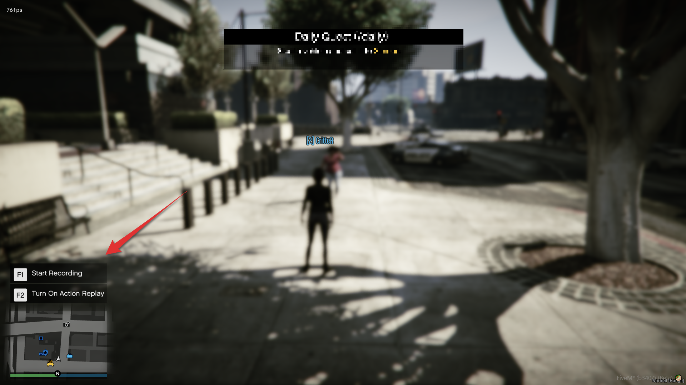

# CritteR's Rockstar Editor Recording Menu

## Description

Honestly, I am surprised I haven't managed to find this menu anywhere on the forums.

It's just the regular menu that shows up when you hold the Character Selector button in GTA V and GTA Online.
Hold down the Character Selector button (Left Alt by default) and view the contents.

It automatically blocks the control actions 288, 289 and 170, to prevent you from opening menus on those actions.
It automatically doesn't work when you have the pause menu opened, or NUI focused.

It also shows you the tutorial messages, but you can remove those in the files.

## Install

Either download the entire resource and run it, but I suggest just getting the `cl_reditor_menu.lua` file and put it as client script in one of your other resources.

## Screenshot

